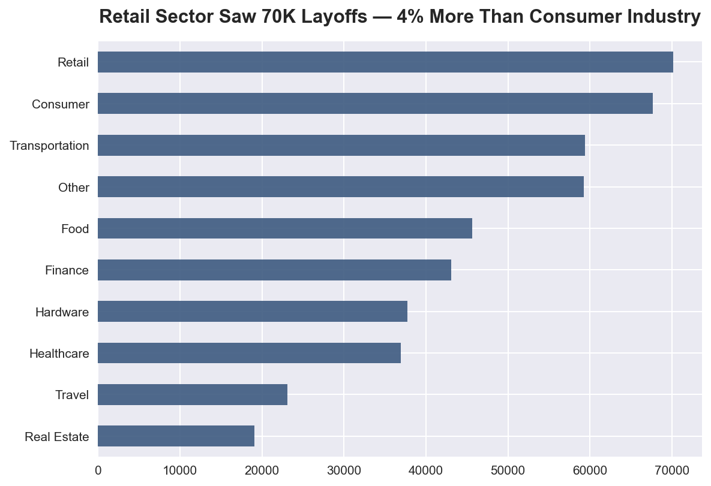
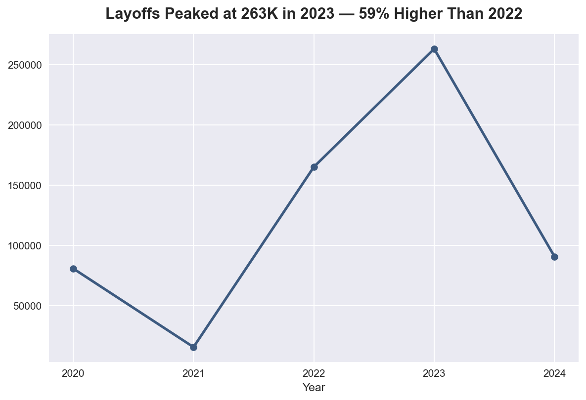
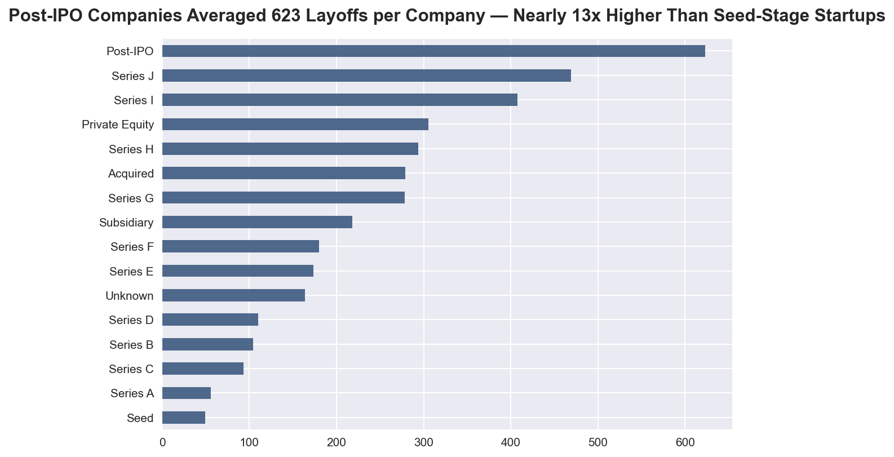
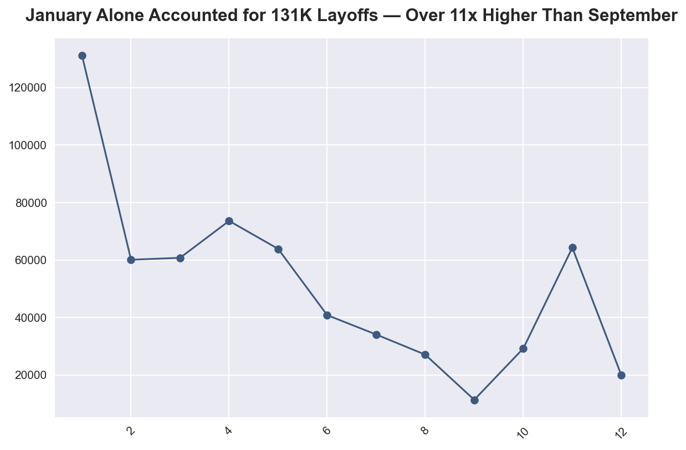

# **Global Tech Layoffs EDA (2020–2024)**

---

## Overview

A Python-based exploratory data analysis of global tech layoffs across 3,642 
recorded events between 2020 and 2024 — built to identify which industries, 
countries, and company funding stages were hit hardest, how layoffs trended over 
time, and what the data reveals about workforce reduction patterns across the 
tech sector.

---

## Objective

To analyse the global tech layoff wave between 2020 and 2024 — identifying which 
industries, countries, and company funding stages were hit hardest, how layoffs 
trended over time, and whether a company's size or capital raised has any 
relationship with the scale of job cuts.

---

## Business Questions

**1. Which industries were most impacted by layoffs during the tech downturn?**

**2. How did layoff trends evolve over time?**

**3. Did company maturity influence layoff severity?**

---

## Key Findings

**Finding 1 — Retail and Consumer sectors bore the heaviest burden**
Retail recorded the highest total layoffs of any industry at 70,157, followed 
closely by Consumer at 67,675, together accounting for the two hardest-hit 
sectors. Both industries expanded aggressively during the pandemic boom and 
contracted sharply when consumer spending normalised.

**Finding 2 — 2023 was the peak layoff year, with 263,180 job cuts**
Layoffs grew 16x from 2021 (15,823) to their 2023 peak (263,180), a dramatic mass 
correction after pandemic-era overhiring. 2024 shows early signs of stabilisation 
at 90,916.

**Finding 3 — Post-IPO companies averaged 623 layoffs, 12x more than Seed stage**
With an average of 623 layoffs per company, Post-IPO firms cut workforces at 
dramatically higher rates than early-stage startups like Seed (49 average). 
Public market pressure and shareholder scrutiny, not company size alone, appears 
to drive more aggressive workforce reductions.

---

## Recommendations

**Recommendation 1 — Monitor Early Warning Signals to Avoid Reactive Layoffs**
Given the sharp spike in 2023 and concentrated monthly layoffs, companies should 
monitor key signals like hiring velocity, burn rate, and funding environment shifts. 
Tracking these indicators regularly can help identify overexpansion before it 
becomes unsustainable. This enables proactive workforce adjustments rather than 
reactive layoffs during downturns.

**Recommendation 2 — Treat Post-IPO Status as a Layoff Risk Indicator, Not a Safety Signal**
Post-IPO companies recorded the highest average layoffs at 623 per event, indicating 
significant workforce restructuring even after going public. Investors and board 
members should evaluate headcount trends post-IPO alongside financial performance 
to better assess organisational stability.

---

## Charts

### Industry Layoffs


### Yearly Trend


### Funding Stage Analysis


### Monthly Trend


---

## Tools & Technologies

- **Python**
- **Pandas**
- **Matplotlib & Seaborn**


---

## Dataset

- **Source:** [Layoffs Data 2022–2024 — Kaggle](https://www.kaggle.com/datasets/theakhilb/layoffs-data-2022/data)
- **Rows:** 3,642 | **Columns:** 12 (9 after cleaning)
- **Period Covered:** 2020 – 2024
- **Key Columns:** Company, Industry, Country, Stage, Laid_Off_Count, 
  Percentage, Funds_Raised, Date

---

## Conclusion

This analysis reveals that the global tech layoff wave was neither random nor 
evenly distributed. Retail and Consumer sectors bore the heaviest burden, 2023 
marked a dramatic peak driven by pandemic-era overhiring corrections, and 
Post-IPO companies — often assumed to be the most stable — averaged 12x more 
layoffs per event than early-stage startups. The data challenges conventional 
assumptions about safety and stability in the tech job market and offers 
actionable signals for both job seekers and organisational decision-makers.

---

```
